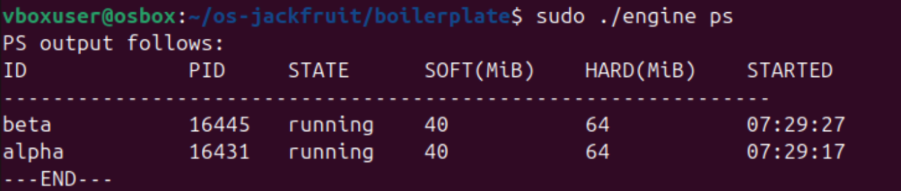
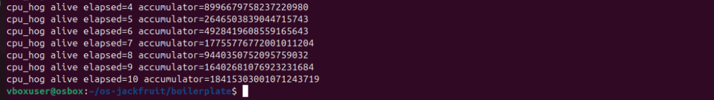
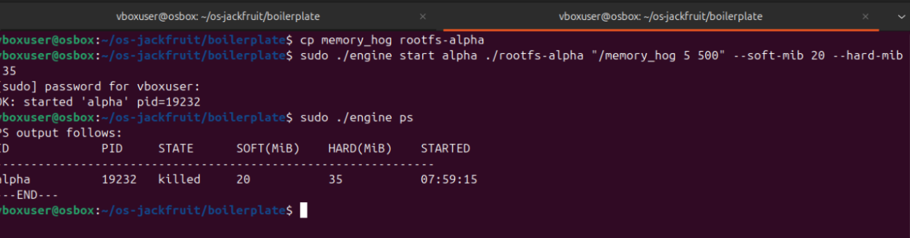
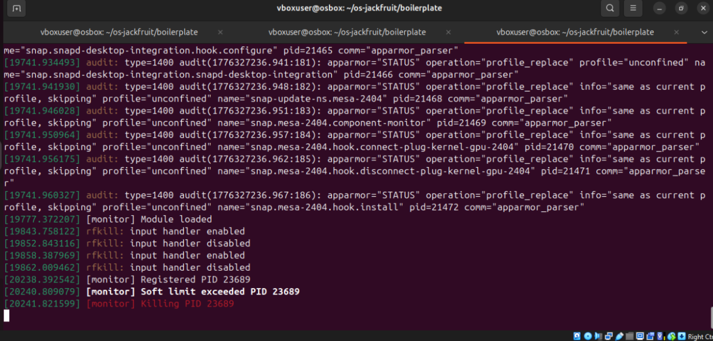
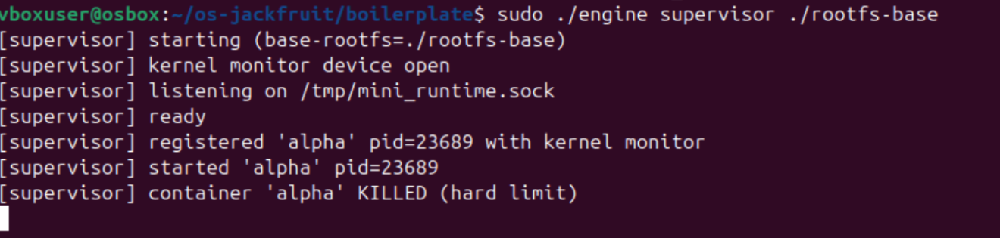
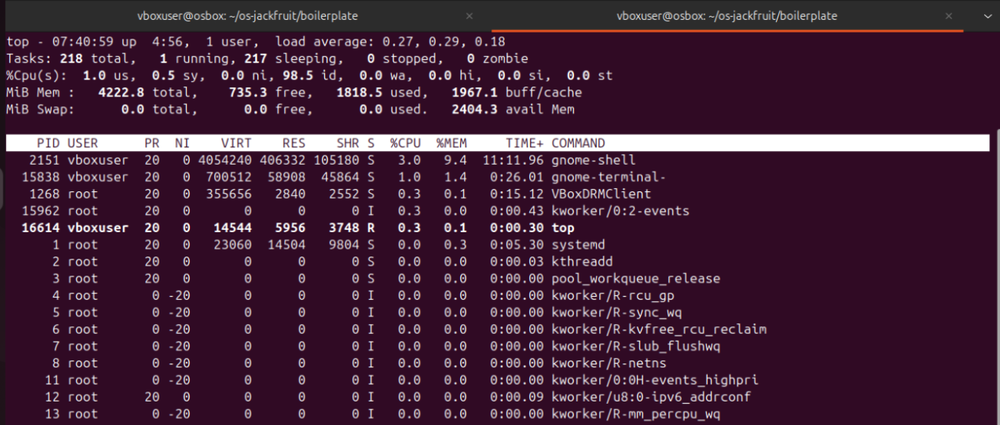
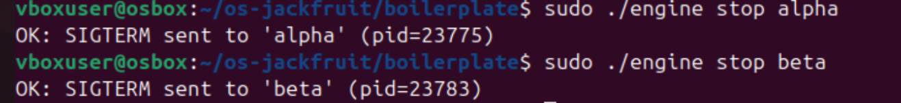

# Supervised Multi-Container Runtime

## Overview

This project delivers a lightweight container runtime implemented in C, featuring a continuously running supervisor process. It allows multiple containers to run concurrently, keeps track of their metadata, captures logs, and enables scheduling-related experiments.

The implementation demonstrates essential Operating Systems concepts, including:

- Namespace-based process isolation  
- Inter-process communication (IPC)  
- Process lifecycle handling  
- Thread synchronization  
- Scheduling through nice values  

---

## System Requirements

- Ubuntu 22.04 or 24.04 (Virtual Machine recommended)  
- Not supported on WSL  
- `sudo` privileges required for namespace operations  

### Install Dependencies

    sudo apt update
    sudo apt install -y build-essential linux-headers-$(uname -r)

---

## Build Instructions

    cd src/
    make

Build outputs:

- `engine` — user-space runtime  
- `monitor.ko` — kernel module  

---

## Running the Project

### 1. Start the Supervisor

Terminal 1:

    sudo ./engine supervisor ./rootfs-base

---

### 2. Start Containers

Terminal 2:

    sudo ./engine start alpha ./rootfs-alpha /bin/sh
    sudo ./engine start beta  ./rootfs-beta  /bin/sh

---

### 3. View Container Metadata

    sudo ./engine ps

This displays:

- Container ID  
- PID  
- State  
- Memory limits  
- Start time  

---

## Logging Demonstration (Task 3)

Ensure to create the rootfs directories beforehand
To generate logs, run a workload inside the container:

    cp cpu_hog rootfs-alpha/

Restart the supervisor (to clear stale sockets):

    rm -f /tmp/mini_runtime.sock
    sudo ./engine supervisor ./rootfs-base

Run the workload:

    sudo ./engine start alpha ./rootfs-alpha "/cpu_hog 15"

View logs:

    cat logs/alpha.log

This demonstrates the bounded-buffer logging pipeline.

---

## Stopping Containers

    sudo ./engine stop alpha

---

## Kernel Monitor (Task 4)

Load the kernel module:

    sudo insmod monitor.ko

Verify:

    ls -l /dev/container_monitor

---

### Memory Limit Test

    cp memory_hog rootfs-alpha/

Terminal 1:

    sudo ./engine supervisor ./rootfs-base

Terminal 3:

    sudo dmesg -w

Terminal 2:

    sudo ./engine start alpha ./rootfs-alpha "/memory_hog 5 500" --soft-mib 20 --hard-mib 35

Check metadata:

    sudo ./engine ps

---

## Scheduling Experiment (Task 5)

Copy workloads:

    cp cpu_hog rootfs-alpha/
    cp cpu_hog rootfs-beta/

Start supervisor:

    sudo ./engine supervisor ./rootfs-base

Run containers with different priorities:

    sudo ./engine start alpha ./rootfs-alpha "/cpu_hog 30" --nice -5
    sudo ./engine start beta  ./rootfs-beta  "/cpu_hog 30" --nice 5

Monitor CPU usage:

    top

Compare completion times:

    tail -3 logs/alpha.log
    tail -3 logs/beta.log

Expected:

- Lower nice value → faster execution  
- Higher nice value → slower execution  

---

## Cleanup Verification (Task 6)

Stop containers:

    sudo ./engine stop alpha
    sudo ./engine stop beta

Check for zombie processes:

    ps aux | grep -E 'Z|defunct'

Check socket cleanup:

    ls /tmp/mini_runtime.sock

Unload module:

    sudo rmmod monitor

Check kernel logs:

    dmesg | tail -3

---

## Key Concepts Demonstrated

- Supervisor-based container management  
- Namespace isolation (PID, UTS, mount)  
- UNIX domain socket IPC (CLI ↔ supervisor)  
- Pipe-based logging (container → supervisor)  
- Bounded buffer with producer-consumer threads  
- Kernel-level memory monitoring (soft and hard limits)  
- Linux scheduling using nice values  

---

## Notes

- Containers using `/bin/sh` exit immediately and produce no logs  
- Workloads like `cpu_hog` are required to generate logs  
- `rm -f /tmp/mini_runtime.sock` resolves stale socket issues  
- Most commands require `sudo`  

---

## Demo Screenshots

### Task 1: Multi-container supervision

Shows two containers (`alpha` and `beta`) running under a single supervisor.

---

### Task 2: Metadata tracking (`ps`)

Displays container details including ID, PID, state, memory limits, and start time.

---

### Task 3: Bounded-buffer logging

Shows output from `cpu_hog` captured in `logs/alpha.log`, demonstrating the logging pipeline.

---

### Task 4: CLI and IPC

Shows CLI commands interacting with the supervisor through IPC.

---

### Task 5: Soft-limit warning

Shows kernel logs when a container exceeds its soft memory limit.

---

### Task 6: Hard-limit enforcement

Shows kernel logs where a container is terminated after exceeding the hard memory limit.

---

### Task 7: Scheduling experiment

Shows containers with different nice values demonstrating execution differences.

---

### Task 8: Clean teardown

Shows that all containers are stopped and no zombie processes remain.

---

## Conclusion

This project illustrates how container runtimes operate using Linux primitives. It combines user-space and kernel-space components to manage processes, enforce limits, and analyze scheduling behavior in a controlled setup.